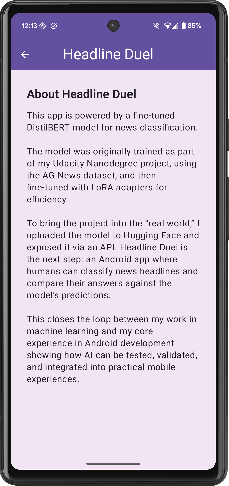

# 📰 Headline Duel KMP

**Headline Duel KMP** is a Kotlin Multiplatform (KMP) reimagining of the original Android app. It brings the same interactive AI experience—connecting a fine-tuned **DistilBERT news classifier** with a mobile UI—to both **Android and iOS** using a single shared codebase.

This project serves as a showcase of **modern mobile development** (Kotlin Multiplatform, Compose Multiplatform) alongside **applied Generative AI** (LLM fine-tuning, Hugging Face integration).

## 🎥 Demo

*See the app in action on both platforms:*

| Android Demo                                                                                                                                                   | iOS Demo                                                                                                                                                                      |
|:---------------------------------------------------------------------------------------------------------------------------------------------------------------|:------------------------------------------------------------------------------------------------------------------------------------------------------------------------------|
|  |  |

## ✨ Features

- **Cross-Platform:** Runs natively on Android and iOS with nearly 100% code sharing.
- **Interactive AI:** Classify real headlines as *World, Sports, Business, or Sci/Tech* and compete against a model.
- **Real-time Inference:** Powered by a custom Hugging Face Space API.
- **Modern UI:** Built with **Compose Multiplatform** for a unified Material Design experience.

## 🚀 How It Works

1. **The Challenge:** You are presented with a real headline from the AG News dataset.
2. **The Guess:** You predict its category (World, Sports, Business, Sci/Tech).
3. **The AI:** The app simultaneously queries a fine-tuned DistilBERT model hosted on Hugging Face.
4. **The Duel:** The app reveals who was right—you, the AI, or both.

## 🛠 Tech Stack (KMP)

This project migrates the original native Android architecture to a full KMP stack:

| Layer | Technology |
| :--- | :--- |
| **UI** | [Compose Multiplatform](https://www.jetbrains.com/lp/compose-multiplatform/) (Material 3) |
| **Language** | Kotlin (Common, Android, iOS) |
| **Networking** | [Ktor](https://ktor.io/) (Content Negotiation, Logging) |
| **Injection** | [Koin](https://insert-koin.io/) (Cross-platform Dependency Injection) |
| **Concurrency** | Kotlin Coroutines & Flows |
| **Architecture** | Clean Architecture (Domain, Data, UI layers in `commonMain`) |
| **Testing** | [Kotlin Test](https://kotlinlang.org/docs/multiplatform/multiplatform-run-tests.html), JUnit, [Kotlinx Coroutines Test](https://github.com/Kotlin/kotlinx.coroutines/blob/master/kotlinx-coroutines-test/README.md), [Ktor Client Mock](https://ktor.io/docs/client-testing.html) |

## 🤖 Model Details

The intelligence behind the app remains the same custom-tuned model:

- **Base Model:** [DistilBERT](https://huggingface.co/distilbert-base-uncased)
- **Fine-tuning:** LoRA (Low-Rank Adaptation) on the AG News dataset.
- **Hosting:** [Hugging Face Spaces](https://huggingface.co/spaces/gemmalarasav/news-classifier-space)
- **API:** The KMP app consumes this via a REST endpoint using Ktor.

## 📚 The Migration Story

This project is an evolution of my [original Android-only Headline Duel](https://github.com/GemmaLaraSavill/headline-duel).

**Why KMP?**
As an Android developer expanding into AI, I wanted to demonstrate how easily modern AI features can be deployed across platforms. By migrating to KMP, I moved the business logic and UI code into `commonMain`, allowing the exact same "Duel" experience to run on an iPhone without rewriting the complex interaction logic.

## 👩 Author

**Gemma Lara Savill**  
*Android & KMP Developer | AI Enthusiast*

- 🌐 Website: [myhappyplace.dev](https://www.myhappyplace.dev)
- 🐙 GitHub: [GemmaLaraSavill](https://github.com/GemmaLaraSavill)
